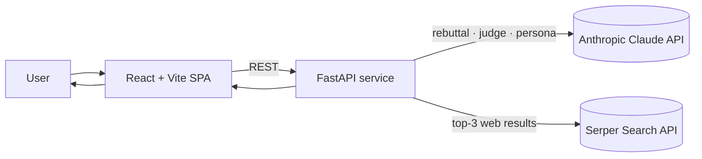
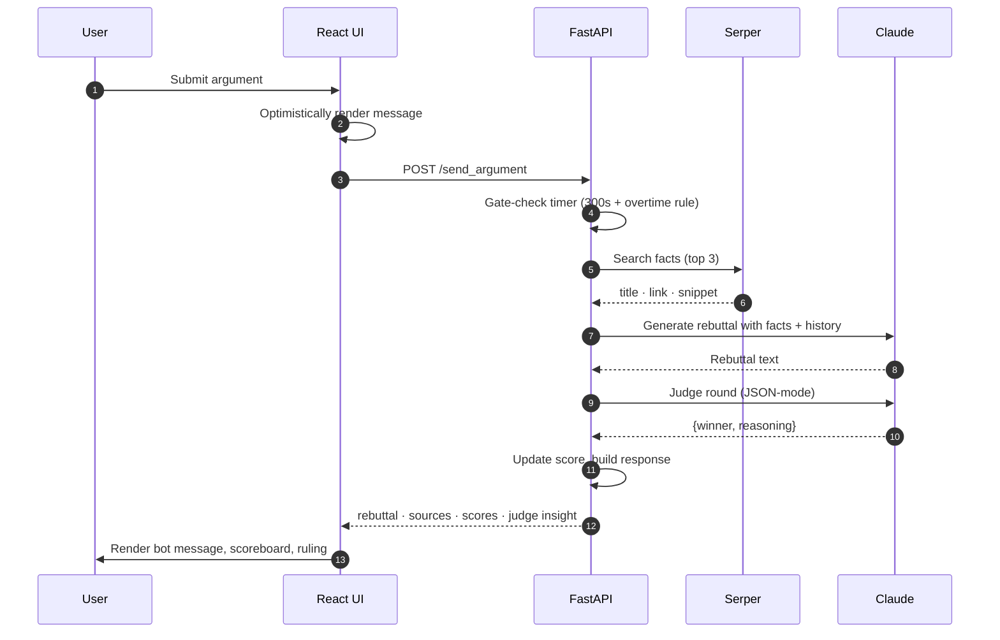

# Sir Interruptsalot

> A real-time, full-stack AI debate app. You make an argument. An AI opponent
> fires back a confident, web-grounded rebuttal. An AI judge scores each round.
> At the end, you get a personality roast report.

[](LICENSE)


<!-- Add a deployed link here when live, e.g. https://sir-interruptsalot.example.com -->
<!--  -->

---

## Table of contents

- [Why this project](#why-this-project)
- [Highlights](#highlights)
- [Architecture](#architecture)
- [How a round works](#how-a-round-works)
- [Prompt engineering](#prompt-engineering)
- [Quick start](#quick-start)
- [Project layout](#project-layout)
- [Engineering notes & trade-offs](#engineering-notes--trade-offs)
- [Roadmap](#roadmap)
- [Tech stack](#tech-stack)
- [Deployment](#deployment)
- [License](#license)

---

## Why this project

Most "chat with an AI" demos are a single text box and a single response. This
project is the opposite: it's a **structured, time-boxed game loop** built on
top of an LLM, with real product constraints — latency budgets, JSON-mode
reliability, source attribution, optimistic UI, and a scoring system that has
to feel fair.

It's a deliberate exercise in shipping a complete, opinionated LLM product end
to end, not just wiring up an API.

## Highlights

- **Three orchestrated Claude calls per round** — rebuttal generation, an
  impartial JSON-mode judge, and an end-of-session persona report — each with
  its own prompt, model parameters, and failure mode.
- **Source-grounded rebuttals** — every round retrieves the top three Google
  results via Serper, injects them into the rebuttal prompt with `[Source]`
  citations, and returns them to the UI as expandable cards.
- **Time-aware game state** — a 300-second timer that's gate-checked
  server-side, with a graceful **overtime exception** so a half-typed
  argument isn't lost on the buzzer.
- **Adaptive bot voice** — Claude is prompted to pick between Gen Z and
  Victorian style based on the topic, mid-conversation, without an explicit
  style flag.
- **Latency-aware UX** — optimistic message rendering, scoreboard updates
  pipelined with the judge's reasoning, and a contextual auto-scroll
  (mobile-always, desktop-only-if-near-bottom).
- **Single-binary deploy** — repository ships with a `render.yaml` Blueprint
  that deploys backend + static frontend in one push.

## Architecture



Two services, two external APIs, no database. Sessions are kept in process,
which is a conscious v1 trade-off (see [trade-offs](#engineering-notes--trade-offs)).

## How a round works



Per-round cost is **3 sequential external calls**: Serper, then rebuttal
generation, then the judge. They have to be sequential because the judge
needs the bot's rebuttal as input. Typical round wall-clock is dominated by
the two Claude calls.

## Prompt engineering

Three distinct prompts, each tuned independently:

| Prompt          | Model                          | Tokens | Notes                                                                  |
| --------------- | ------------------------------ | ------ | ---------------------------------------------------------------------- |
| Rebuttal        | `claude-3-5-sonnet-20241022`   | 180    | Last 6 turns of history + Serper facts; style chosen from topic        |
| Judge           | `claude-3-5-sonnet-20241022`   | 200    | Strict JSON output (`{winner, reasoning}`); ties on parse failure      |
| Persona report  | `claude-3-5-sonnet-20241022`   | 600    | Full session history; structured roast with scored categories          |

The rebuttal prompt is intentionally brief ("3–4 lines max, punchy") because
debate UX dies when responses are walls of text. The judge prompt asks Claude
to **default to a tie if both sides are equally weak or strong**, which
prevents the scoreboard from drifting on weak inputs.

See [backend/argument_bot.py](backend/argument_bot.py) for the full prompts.

## Quick start

**Prerequisites:** Python 3.8+ (3.11 recommended), Node.js 16+, an
[Anthropic API key](https://console.anthropic.com/), and a
[Serper API key](https://serper.dev/) (2,500 free queries).

```bash
git clone https://github.com/saltnpepper12/Sir-Interruptsalot.git
cd Sir-Interruptsalot

# Backend
cd backend
pip install -r requirements.txt
cp .env.example .env        # then add ANTHROPIC_API_KEY and SERPER_API_KEY

# Frontend
cd ..
npm install

# Run both (frontend :5173, backend :8000)
npm run start
```

Or, the one-shot helper that does all of the above:

```bash
./start.sh        # macOS / Linux
./start.bat       # Windows
```

### npm scripts

| Script            | What it does                                       |
| ----------------- | -------------------------------------------------- |
| `npm run dev`     | Vite dev server (frontend only, port 5173)         |
| `npm run backend` | Uvicorn (backend only, port 8000)                  |
| `npm run start`   | Both services concurrently                         |
| `npm run build`   | Production build to `dist/`                        |
| `npm run preview` | Preview the production build                       |
| `npm run lint`    | ESLint                                             |

### Backend endpoints (abridged)

| Method | Path             | Purpose                                    |
| ------ | ---------------- | ------------------------------------------ |
| `GET`  | `/health`        | Liveness check                             |
| `POST` | `/start_session` | Begin a session from the opening argument  |
| `POST` | `/send_argument` | Submit a round; returns rebuttal + score   |
| `POST` | `/end_session`   | Close the session, return persona report   |

Full reference: [backend/README.md](backend/README.md).

## Project layout

```
.
├── src/                    React + TypeScript frontend
│   ├── App.tsx             Entry: welcome popup + Arena router
│   ├── main.tsx            Vite entry, mounts <App />
│   ├── components/
│   │   ├── Arena.tsx       Core game UI: timer, scoring, autoscroll, overtime
│   │   ├── RoomCard.tsx
│   │   └── ui/             Radix / shadcn primitives
│   └── styles/globals.css  Tailwind layers + design tokens
│
├── backend/                FastAPI service
│   ├── app.py              Routes, request/response models, CORS, time gate
│   ├── argument_bot.py     SassyArgumentBot: prompts, judging, persona report
│   ├── requirements.txt
│   ├── render.yaml         Render Blueprint (backend only)
│   └── .env.example
│
├── docs/                   Demo media (GIF / screenshots)
├── experiments/            Earlier prototypes — kept for history, not maintained
├── render.yaml             Render Blueprint (both services)
├── start.sh / start.bat    One-shot dev launcher
├── vite.config.ts          @/ alias → ./src
├── tailwind.config.js
├── tsconfig.json
├── index.html              Vite entry
└── package.json
```

The interesting files to read first if you want to understand the system:

1. [src/components/Arena.tsx](src/components/Arena.tsx) — game UI, timer,
   optimistic updates, overtime logic, autoscroll heuristics.
2. [backend/argument_bot.py](backend/argument_bot.py) — three prompts and
   their parameter choices.
3. [backend/app.py](backend/app.py) — request flow and the time-gate that
   enforces the 5-minute rule server-side.

## Engineering notes & trade-offs

This is a v1 demo, not a multi-tenant service. The interesting decisions
are documented honestly so the trade-offs are visible.

- **In-memory single session.** The backend holds one global
  `SassyArgumentBot` instance with one `session` attribute. Two simultaneous
  users would clobber each other's state. The fix is to key sessions by
  `session_id` (already returned to the client) and store them in Redis or
  a SQLite session table. Deliberately deferred — it's an artifact, not a
  bug.
- **Sequential external calls per round.** Serper → rebuttal → judge are
  serial. The judge depends on the bot's rebuttal, so the rebuttal call is
  on the critical path; Serper could be moved earlier or even run in
  parallel with a speculative empty-facts rebuttal.
- **Judge robustness.** The judge prompt asks for strict JSON and the
  parser falls back to "tie" on failure. With a smaller model this would
  drift; on Sonnet-3.5 it has been stable across testing, but a tool-use
  / structured output schema is the obvious next step.
- **CORS is wildcard.** Fine for a demo; tighten to the deployed frontend
  origin before production.
- **No persistence.** Sessions and personas are lost on backend restart by
  design — this is a game session, not a record. If it became one, persona
  reports are the obvious thing to keep.
- **Optimistic UI rollback.** When `send_argument` fails, the frontend
  pops the user message it added optimistically rather than leaving it
  stranded. Small detail, large UX impact.

## Roadmap

- Multi-user session store (Redis or SQLite) keyed by `session_id`
- Structured-output / tool-use schema for the judge call
- Streaming rebuttals (Anthropic SSE) for first-token feedback
- Persisted persona reports with shareable URLs
- Difficulty modes (the bot picks a stronger or weaker stance)
- Per-round latency telemetry surfaced to the UI

## Tech stack

**Frontend** — React 18, TypeScript 5, Vite 4, Tailwind CSS, Radix UI / shadcn,
Framer Motion, Lucide.
**Backend** — FastAPI, Pydantic, Uvicorn, `anthropic` SDK, `httpx`,
Anthropic Claude (3.5 Sonnet), Serper Search.
**Tooling** — ESLint, PostCSS, Autoprefixer, Render Blueprint.

## Deployment

The repository ships a `render.yaml` at the root that describes both the
backend (Python web service) and the frontend (static site). Pushing the
repo to a [Render Blueprint](https://render.com/docs/blueprint-spec)
deploys both services. Set `ANTHROPIC_API_KEY` and `SERPER_API_KEY` in the
Render dashboard under the backend service; the frontend reads
`VITE_API_BASE_URL` at build time to point at the deployed backend URL.

The frontend builds to a static `dist/` directory and can also be hosted on
Netlify, Vercel, S3 + CloudFront, or any static host — the `npm run build`
output is portable.

## License

[MIT](LICENSE) © Monish Raman
