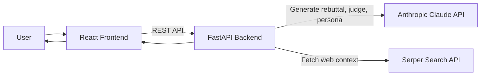
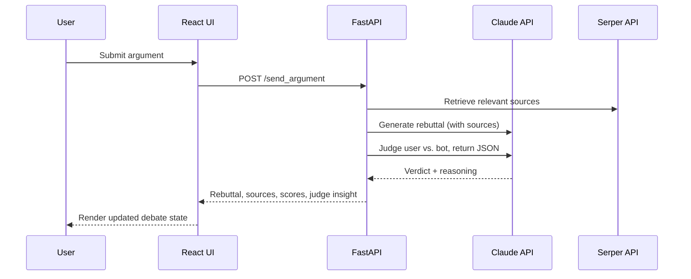

# Sir Interruptsalot

A real-time AI debate app: you make an argument, an AI opponent fires back
confident, web-grounded rebuttals, an AI judge scores each round, and you
get a personality-style report at the end.

**What this project demonstrates:** shipping a complete, full-stack LLM
product — a React/TypeScript frontend, a FastAPI backend, live Claude API
integration, external web-search grounding (Serper), session/state
management, and round-by-round scoring logic.

<!-- Add a deployed demo link here when live, e.g. https://... -->
<!--  -->

---

## Key capabilities

- Live debate loop with low-latency AI rebuttals
- Round-by-round scoring from an AI judge
- Time-boxed 5-minute sessions with optional overtime
- Source-grounded responses enriched via Serper web search
- End-of-session personality roast report
- Responsive web UI with dark mode

---

## Architecture



Request flow for one round:



---

## Tech stack

**Frontend:** React 18 + TypeScript, Vite, Tailwind CSS, Radix UI, Framer Motion, Lucide
**Backend:** FastAPI, Pydantic, Uvicorn, Anthropic Claude API, Serper Search API
**Tooling:** ESLint, PostCSS, Autoprefixer

---

## Quick start

**Prerequisites:** Python 3.8+ (3.11 recommended), Node.js 16+, an
[Anthropic API key](https://console.anthropic.com/), and a
[Serper API key](https://serper.dev/).

```bash
git clone https://github.com/saltnpepper12/Sir-Interruptsalot.git
cd Sir-Interruptsalot

# Backend
cd backend
pip install -r requirements.txt
cp .env.example .env        # then add ANTHROPIC_API_KEY and SERPER_API_KEY

# Frontend
cd ..
npm install

# Run both (frontend on :5173, backend on :8000)
npm run start
```

Or use the helper script, which performs the same steps end to end:

```bash
./start.sh        # macOS / Linux
./start.bat       # Windows
```

### npm scripts

| Script              | Description                                    |
| ------------------- | ---------------------------------------------- |
| `npm run dev`       | Vite dev server (frontend only, port 5173)     |
| `npm run backend`   | Uvicorn (backend only, port 8000)              |
| `npm run start`     | Run frontend and backend concurrently          |
| `npm run build`     | Production build to `dist/`                    |
| `npm run preview`   | Preview the production build                   |
| `npm run lint`      | ESLint                                         |

---

## API endpoints

| Method | Path              | Purpose                                    |
| ------ | ----------------- | ------------------------------------------ |
| `GET`  | `/health`         | Liveness check                             |
| `POST` | `/start_session`  | Begin a session from the opening argument  |
| `POST` | `/send_argument`  | Submit a round; returns rebuttal + score   |
| `POST` | `/end_session`    | Close the session, return persona report   |

Full backend reference: [`backend/README.md`](backend/README.md).

---

## Project structure

```
.
├── src/                    # React + TypeScript frontend
│   ├── App.tsx
│   ├── main.tsx
│   ├── components/         # Arena, RoomCard, Radix/shadcn UI primitives
│   └── styles/
├── backend/                # FastAPI service
│   ├── app.py              # Routes, request/response models, CORS
│   ├── argument_bot.py     # SassyArgumentBot: prompts, judging, persona
│   ├── requirements.txt
│   ├── render.yaml         # Render Blueprint (backend-only)
│   └── .env.example
├── docs/                   # Demo media (GIF / screenshots)
├── experiments/            # Earlier prototypes — kept for history, not maintained
├── guidelines/             # Design notes
├── index.html              # Vite entry
├── render.yaml             # Render Blueprint (frontend + backend)
├── start.sh / start.bat    # One-shot dev launcher
├── tailwind.config.js
├── tsconfig.json
├── vite.config.ts
├── package.json
└── README.md
```

---

## Deployment

Both services are described by `render.yaml` at the repo root and can be
deployed in one step via a [Render Blueprint](https://render.com/docs/blueprint-spec).
Set `ANTHROPIC_API_KEY` and `SERPER_API_KEY` in the Render dashboard under
the backend service. The frontend reads `VITE_API_BASE_URL` at build time
to point at the deployed backend.

---

## License

[MIT](LICENSE)
