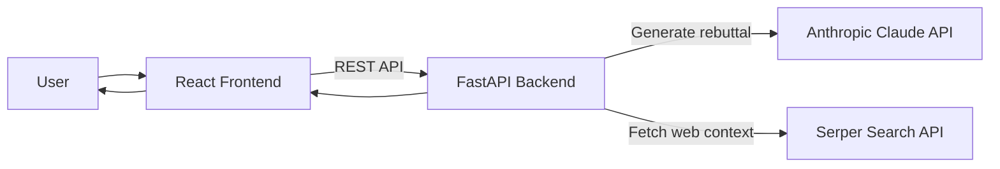
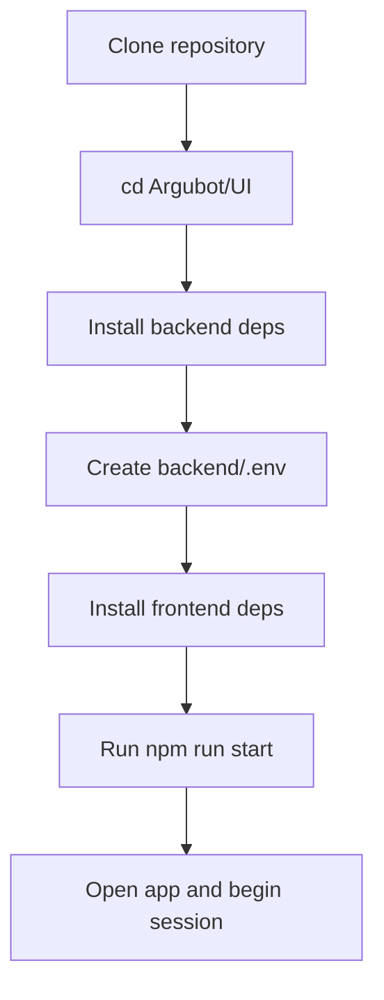
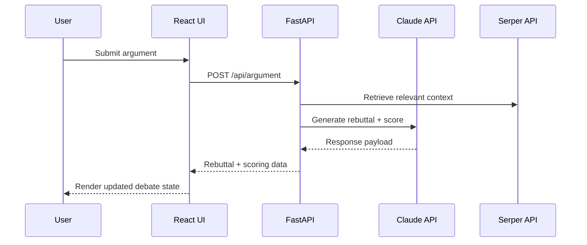

# Sir Interruptsalot

`Sir Interruptsalot` is a real-time AI debate application that challenges user arguments with confident, source-aware rebuttals.

The platform pairs a React frontend with a FastAPI backend powered by Anthropic Claude, then scores each exchange and generates a final personality-style report at the end of a session.

## Key Capabilities

- **Live debate loop** with fast AI rebuttals
- **Round-by-round scoring** from an AI judge
- **Time-boxed sessions** for focused gameplay
- **Source-assisted responses** enriched via Serper search
- **Session summary report** with score and personality feedback
- **Modern web UI** built for responsiveness and clarity

## System Architecture



## Setup Flow



## Technology Stack

### Frontend

- React 18 with TypeScript
- Vite
- Tailwind CSS
- Framer Motion
- Radix UI

### Backend

- FastAPI
- Anthropic Claude API
- Pydantic
- Uvicorn

## Prerequisites

- Python 3.8 or later
- Node.js 16 or later
- Anthropic API key: [console.anthropic.com](https://console.anthropic.com/)
- Serper API key: [serper.dev](https://serper.dev/)

## Quick Start

### Option 1: Scripted startup (recommended)

Run from `Argubot/UI`:

**Windows**

```bash
start.bat
```

**macOS / Linux**

```bash
chmod +x start.sh
./start.sh
```

### Option 2: Manual setup

1. Navigate to the application folder:

```bash
cd Argubot/UI
```

2. Install backend dependencies:

```bash
cd backend
pip install -r requirements.txt
```

3. Create `backend/.env` with your keys:

```env
ANTHROPIC_API_KEY=your_anthropic_api_key_here
SERPER_API_KEY=your_serper_api_key_here
```

4. Install frontend dependencies:

```bash
cd ..
npm install
```

5. Start both services:

```bash
npm run start
```

## Runtime Request Flow



## Development Commands

Run from `Argubot/UI`:

```bash
# Frontend only
npm run dev

# Backend only
npm run backend

# Frontend + backend
npm run start

# Production build
npm run build
```

## API Endpoints

- `POST /api/session/start`: Start a new debate session
- `POST /api/argument`: Submit a user argument and receive a rebuttal
- `GET /api/session/{id}/status`: Retrieve current session status
- `POST /api/session/{id}/end`: End session and generate final report

## User Journey

1. Enter an opinion or claim.
2. Start a debate session.
3. Respond to each AI rebuttal.
4. Track score progression round by round.
5. End the session and review your final report.

## Project Structure

```text
Argubot/UI/
├── src/
│   ├── App.tsx
│   ├── components/
│   │   ├── Arena.tsx
│   │   └── ui/
│   └── styles/
│       └── globals.css
├── backend/
│   ├── app.py
│   ├── requirements.txt
│   └── .env                 # create locally
├── package.json
├── start.sh
├── start.bat
└── README.md
```

## Troubleshooting

**Backend does not start**

- Check Python version: `python --version`
- Reinstall backend dependencies: `pip install -r backend/requirements.txt`
- Verify `backend/.env` is present and correctly populated

**Frontend does not load**

- Check Node version: `node --version`
- Reinstall packages: `rm -rf node_modules && npm install`

**API or response errors**

- Validate Anthropic and Serper keys
- Confirm backend is running on port `8000`
- Inspect browser developer tools for CORS/network errors

## License

MIT
